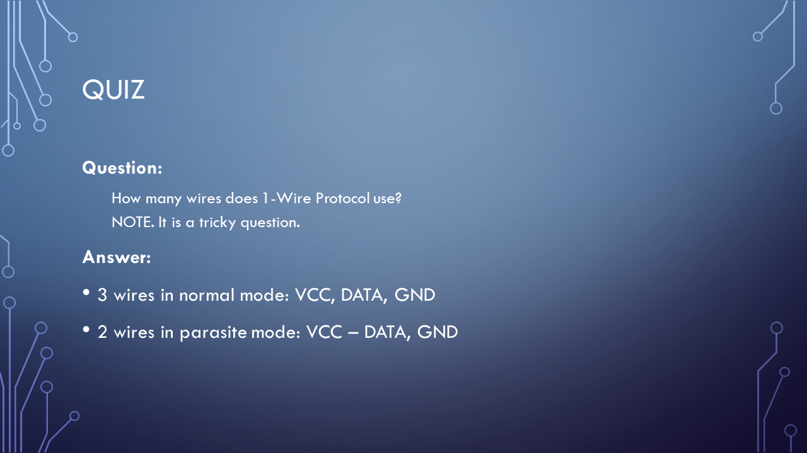

# Slides to presentation IoT on Premises


## How to INSTALL Node-Red


```
sudo apt-get upate
sudo apt-get upgrade

sudo apt-get install nodered
sudo systemctl enable nodered.service

NOTE: from UI install: node-red-dashboard
```


## How to INSTAL Mosquitto?


```
sudo apt-get upate
sudo apt-get upgrade

sudo apt-get install mosquitto
sudo apt-get install mosquitto-clients

sudo mosquitto_passwd -c /etc/mosquitto/passwd IotUserMqtt
sudo systemctl enable mosquitto
```





## References (1)


* Node-RED
    * https://nodered.org/
* Eclipse Mosquitto™
    * https://mosquitto.org/
* Rhasspy Voice Assistant
    * https://rhasspy.readthedocs.io/en/latest/
* AUTODESK ® TINKERCAD™
    * https://www.tinkercad.com/circuits

## References (2)


* Andreas Spiess
    * https://www.youtube.com/channel/UCu7_D0o48KbfhpEohoP7YSQ
* Kevin Darrah
    * https://www.youtube.com/user/kdarrah1234
* MATRIX Labs - Episode 201: Get Started w/ Rhasspy Offline Voice Assistant
    * https://www.youtube.com/watch?v=I9n4NCLTg0k
* Electronoobs
    * https://www.youtube.com/channel/UCjiVhIvGmRZixSzupD0sS9Q


## References (3)


* GreatScott!
    * https://www.youtube.com/user/greatscottlab
* bitluni's lab
    * https://www.youtube.com/user/bitlunislab
* Electronoobs
    * https://www.youtube.com/channel/UCjiVhIvGmRZixSzupD0sS9Q
* Ben Eater
    * https://www.youtube.com/channel/UCS0N5baNlQWJCUrhCEo8WlA

## Where you can find me?


* Web
    * https://lastboardingcall.pl 
    * https://mrmatrix.net 

* GitHub
    * https://github.com/MariuszKrzanowski
* Tweeter
    * [@KrzanowskiM](https://twitter.com/krzanowskim)
* Meetups
    * [Warszawska Grupa .NET](https://www.meetup.com/pl-PL/WG-NET/)
